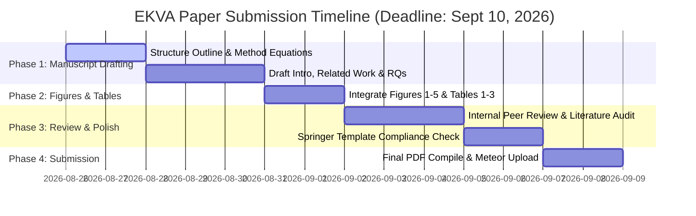

# EKVA Publication Plan of Action & Research Execution Roadmap
### Target: 2nd International Conference on Intelligent Systems and Engineering Applications (ICISEA 2026 / MULTINOVA 2.0)
**Publisher:** Atlantis Press (Part of Springer Nature), *Advances in Intelligent Systems Research (AISR)* Series  
**Submission Deadline:** **10th September 2026** (16 days remaining)  
**Conference Dates:** 20th & 21st November 2026 (Online Mode)  
**Target Paper:** *"Expert, Not Layer: Where Sparse-MoE KV Cache Budgets Should Actually Go"* (EKVA)

---

## 1. Current Project Status: What Is Already Completed

You have completed nearly all empirical, algorithmic, and analytical legs of the research:

| Component / Deliverable | Status | Location / Artifact |
| :--- | :---: | :--- |
| **Core Algorithm & Policies** | ✅ Done | 11 policies implemented (`Uniform`, `EKVA`, `MultiSignal`, `CakeLayerAggregated`, `EntropyOnly`, `RoutingOnly`, `SpecializationOnly`, etc.) in `ekva/budget/policies.py` and `derive.py`. |
| **Simulator & Eviction** | ✅ Done | `ExpertKVBuffer` with recency, attention, random, and hybrid eviction in `ekva/simulator/kv_buffer.py`. |
| **Dynamic Recalibration Cascade** | ✅ Done | `DynamicKVRecalibrationManager` with sliding-window EMA recalibration in `ekva/simulator/dynamic_recalibration.py`. |
| **Unit Test Suite** | ✅ Done | 25 passing unit tests on CPU (`pytest tests/ -q` passes in 0.05s). |
| **RQ1 (Granularity Ablation)** | ✅ Done | Sweep across 3 models (Qwen-MoE 60 exp, Mixtral 8 exp, DeepSeek-MoE 64 exp) in `output/rq1_granularity_and_ablation.pt` & `.json`. |
| **RQ2 (Mechanistic Decoupling)** | ✅ Done | Empirical proof of load-balancing loss decoupling in `output/rq2_mechanistic_analysis.pt` & `.json`. |
| **RQ3 (Transferability & Reasoning)** | ✅ Done | 4x4 cross-domain transfer matrix + GSM8K/MATH reasoning stability vs. InfoKV in `output/rq3_transferability_reasoning.pt` & `.json`. |
| **RQ4 (Roofline & Systems)** | ✅ Done | Analytical roofline modeling and Triton variable-tile decode speedups in `output/analytical_roofline_model.pt` & `.json`. |
| **Publication-Ready Figures** | ✅ Done | All 5 publication figures generated in `output/`: `rq1_granularity_and_ablation.png`, `rq2_mechanistic_analysis.png`, `rq3_transferability_heatmap.png`, `dynamic_recalibration_cascade.png`, `analytical_roofline.png`. |
| **Synthesis Report** | ✅ Done | Full consolidated data tables and findings in `output/EKVA_Research_Report.md`. |
| **Zero-Cost Guide** | ✅ Done | Step-by-step $0 reproduction guide in `docs/FREE_TIER_GUIDE.md`. |

---

## 2. What Is Remaining To Do (Sprint to September 10, 2026)

The empirical and experimental work is complete. The remaining tasks are purely focused on **manuscript authoring, formatting, proofreading, and submission**.

### Detailed Task Breakdown:

### Task 1: Manuscript Drafting (Days 1–5: Aug 26 – Aug 30)
- [ ] **Title & Abstract:** Finalize title (*"Expert, Not Layer: Where Sparse-MoE KV Cache Budgets Should Actually Go"*) and 200-word abstract following the template in `EKVA_Research_Advisory.md`.
- [ ] **Section 1 (Introduction):** Motivation around long-context KV bottlenecks, granularity taxonomy, and the 4 central contributions.
- [ ] **Section 2 (Related Work):** Categorize prior art across token, head, layer, and serving axes. Include explicit disambiguation sentences for **PiKV**, **MoE-nD**, and **TriRoute**.
- [ ] **Section 3 (EKVA Methodology):**
  - Multi-signal formulation: Entropy $\bar{H}_i$, Routing frequency $\log(\text{Route}_i)$, Specialization $\text{Spec}_i$.
  - Constrained allocation algorithm with integer exact-sum correction and $\text{min\_per\_expert} = 64$ starvation floor.
  - Streaming online recalibration cascade with EMA update rule.
  - Variable-tile Triton FA2 kernel design.
- [ ] **Section 4 (Empirical Results & Research Questions):**
  - Sub-sec 4.1: RQ1 Granularity Ablation (Qwen, Mixtral, DeepSeek) + Table 1.
  - Sub-sec 4.2: Component Ablation (Entropy vs Routing vs Multi-Signal) + Table 2.
  - Sub-sec 4.3: RQ2 Mechanistic Decoupling & Aux-Loss Analysis.
  - Sub-sec 4.4: RQ3 Cross-Domain Transfer & Reasoning Resolution vs InfoKV + Table 3.
  - Sub-sec 4.5: RQ4 Hardware Roofline & Kernel Speedup.
- [ ] **Section 5 (Discussion & Limitations):** Hardware constraints, consumer GPU profiling transparency, future distributed clusters.
- [ ] **Section 6 (Conclusion & Reproducibility):** Summary and GitHub repository link.

### Task 2: Typesetting & Springer Atlantis Press Formatting (Days 6–8: Aug 31 – Sept 2)
- [ ] Set up LaTeX project with Atlantis Press / Springer Nature proceedings style (`author-kit` / AISR template).
- [ ] Embed high-resolution vector/PNG figures from `output/`:
  - Figure 1: Entropy & Routing Heterogeneity Heatmap (`output/entropy_heatmap.png` / `rq2_mechanistic_analysis.png`)
  - Figure 2: RQ1 Granularity Curves across 3 Architectures (`output/rq1_granularity_and_ablation.png`)
  - Figure 3: Component Ablation Breakdown
  - Figure 4: RQ3 Transfer Heatmap & Reasoning Stability (`output/rq3_transferability_heatmap.png`)
  - Figure 5: Hardware Roofline & Triton Decode Speedup (`output/analytical_roofline.png`)
- [ ] Format LaTeX tables for RQ1, component ablation, and reasoning stability directly from `output/EKVA_Research_Report.md`.

### Task 3: Reference Consolidation & Literature Audit (Days 9–11: Sept 3 – Sept 5)
- [ ] Compile complete `.bib` file with exact citations:
  - *Ada-KV* (NeurIPS 2025), *CAKE* (2025), *InfoKV* (arXiv 2606.26875), *PiKV* (ICML 2025 ES-FoMo III), *MoE-nD* (arXiv 2604.17695), *TriRoute* (arXiv 2607.06601), *SnapKV* (2024), *PyramidKV* (2024), *FlashAttention-2* (Dao 2023), *Qwen1.5-MoE*, *Mixtral-8x7B*, *DeepSeek-MoE*.
- [ ] Cross-check that PiKV and MoE-nD are accurately characterized to preempt any reviewer confusion.

### Task 4: Final Proofreading & Meteor Submission (Days 12–15: Sept 6 – Sept 9)
- [ ] Check page length against conference limits (standard AISR / Atlantis Press paper length: typically 6–10 pages).
- [ ] Verify author affiliations, corresponding author details, and track selection:
  - **Selected Track:** **Track 1: Machine Learning & Intelligent Systems** (or **Track 4: Intelligent Systems & Architectures**).
- [ ] Register and submit PDF via the **Springer Meteor Portal**:
  - URL: `https://meteor.springer.com/project/dashboard.jsf?id=3188&tab=About&auth_user=618876&auth_key=f3bbdf2d06f6b10caafadba5615e05b3`

---

## 3. All Resources Needed to Go Further

### A. Writing & Typesetting Resources
1. **Conference Template:** Atlantis Press / Springer Nature Proceedings template (LaTeX style files: `proceedings.cls` / `splncs04.bst` or Atlantis Press Word/LaTeX template available on conference portal).
2. **Editor:** Local LaTeX editor (VSCode + LaTeX Workshop / TeX Live) or Overleaf project.
3. **Pre-compiled BibTeX File:** Citations for all 15+ related papers (Ada-KV, CAKE, InfoKV, PiKV, FlashAttention-2, etc.).

### B. Data & Artifact Resources (Already Present in Repo)
1. **Figures:** High-res images in `output/*.png`.
2. **Numerical Tables:** Markdown tables in `output/EKVA_Research_Report.md` and raw data in `output/*.json`.
3. **Codebase Link:** Open-source GitHub repository `https://github.com/GauravPatil2515/EKVA`.

### C. Submission Portal & Conference Links
1. **Conference Website:** [https://conference.aiktc.ac.in/](https://conference.aiktc.ac.in/)
2. **Springer Meteor Submission Portal:** [Meteor Submission Dashboard](https://meteor.springer.com/project/dashboard.jsf?id=3188&tab=About&auth_user=618876&auth_key=f3bbdf2d06f6b10caafadba5615e05b3)
3. **Conference Contact / Queries:** AIKTC School of Engineering & Technology, New Panvel.

### D. Optional Compute Resources (Only if you want extra runs)
1. **Local Setup:** RTX 3050 Laptop (6GB VRAM) using 4-bit quantization for any additional sanity passes.
2. **Free Google Colab T4:** For testing any extended prompt sets at $0 cost (per `docs/FREE_TIER_GUIDE.md`).
